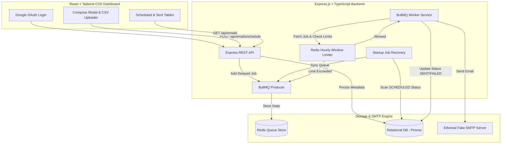

# ReachInbox Full-Stack Email Job Scheduler

Production-grade full-stack email job scheduler service and dashboard built for the **Outbox Labs / ReachInbox Hiring Assignment**.
Deployed Link- https://email-scheduler-two-theta.vercel.app/
---

## 🚀 Key System Features & Highlights

* ⚙️ **Persistent Scheduling Engine (No Cron Jobs)**: Uses **BullMQ** backed by **Redis** to queue delayed email jobs down to the millisecond.
* 🔄 **Restart Resilience & Zero Job Loss**: If the server or worker process restarts, BullMQ reads pending delayed jobs from Redis, and the backend performs an automatic DB recovery scan on boot to ensure no email is duplicated or lost.
* ⚡ **Worker Concurrency & Throttle Delays**: Supports configurable worker concurrency levels (`WORKER_CONCURRENCY`) and minimum inter-email delay throttling to prevent provider rate-limit spikes.
* 🛑 **Redis-Backed Atomic Hourly Rate Limiting**: Enforces strict hourly send caps per sender (`MAX_EMAILS_PER_HOUR`). When the hourly limit is exceeded, jobs are automatically postponed/rescheduled to the beginning of the **next hour window** without failing jobs or losing order.
* ✉️ **Ethereal Fake SMTP Integration**: Automatically provisions or connects to Ethereal SMTP test servers and generates clickable message preview links for each sent email.
* 🎨 **Figma-Matched React Dashboard**: Includes Google OAuth authentication, lead list parser from uploaded CSV/TXT files, live lead count badge, metric cards, scheduled emails table, sent emails log, and Ethereal preview links.

---

## 🏗️ Architecture Overview



---

## 📦 Submission Feature Matrix

| Feature Category | Requirement | Implementation Details | Status |
| :--- | :--- | :--- | :---: |
| **Backend Core** | BullMQ + Redis Scheduler | Used BullMQ `Queue` & `Worker` with Redis. Zero cron jobs used. | ✅ Pass |
| **Persistence** | Server Restart Resilience | Redis persists delayed job states; DB recovery scanner re-enqueues any un-queued `SCHEDULED` records on boot. | ✅ Pass |
| **Concurrency** | Configurable Worker Concurrency | Configured via `WORKER_CONCURRENCY` env variable in `emailWorker.ts`. | ✅ Pass |
| **Throttling** | Delay Between Emails | Configurable delay (`delayBetween` in ms) executed via worker throttling. | ✅ Pass |
| **Rate Limiting** | Hourly Send Limit | Atomic Redis key window (`rate_limit:{sender}:{YYYY-MM-DD-HH}`). Postpones excess jobs to next hour. | ✅ Pass |
| **Idempotency** | Prevent Duplicate Sends | Checked DB status (`SENT`) before worker processing. | ✅ Pass |
| **SMTP** | Ethereal Fake SMTP | Integrated `nodemailer` with Ethereal test accounts & preview links. | ✅ Pass |
| **Frontend** | Google OAuth Login | Real Google OAuth integration (`@react-oauth/google`) + Instant Demo Login. | ✅ Pass |
| **Frontend** | Compose & Lead CSV Upload | Supports drag-and-drop / upload of CSV/TXT lead lists with live lead count. | ✅ Pass |
| **Frontend** | Scheduled & Sent Tables | Figma-inspired tabs, status badges, loading states, empty states, and Ethereal preview links. | ✅ Pass |

---

## ⚙️ Quickstart & Local Setup Guide

### Option A: Standard Local Setup (Recommended)

#### 1. Prerequisites
- Node.js `v18+`
- Redis (running locally on port `6379` or via Docker)

#### 2. Start Redis (via Docker)
```bash
docker run -d -p 6379:6379 --name reachinbox-redis redis:alpine
```

#### 3. Setup & Start Backend
```bash
cd backend
npm install
npx prisma db push
npm run dev
```

#### 4. Setup & Start Frontend
```bash
cd frontend
npm install
npm run dev
```
